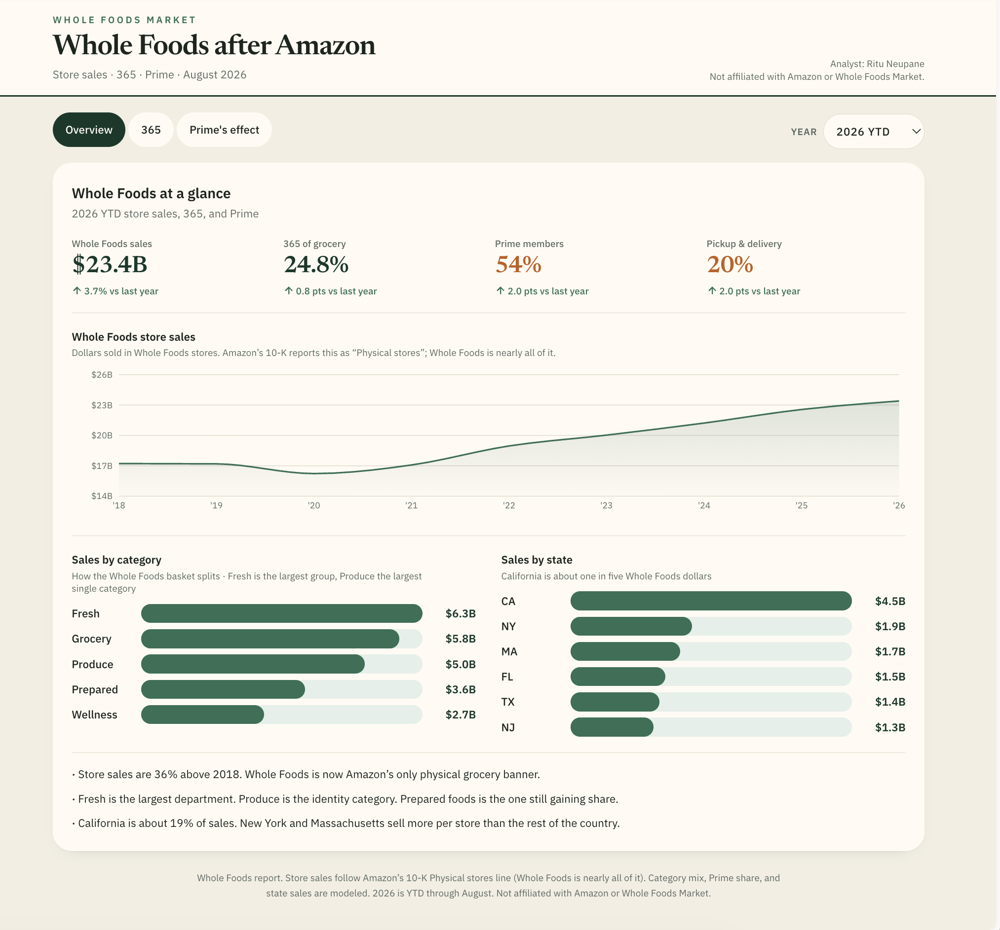
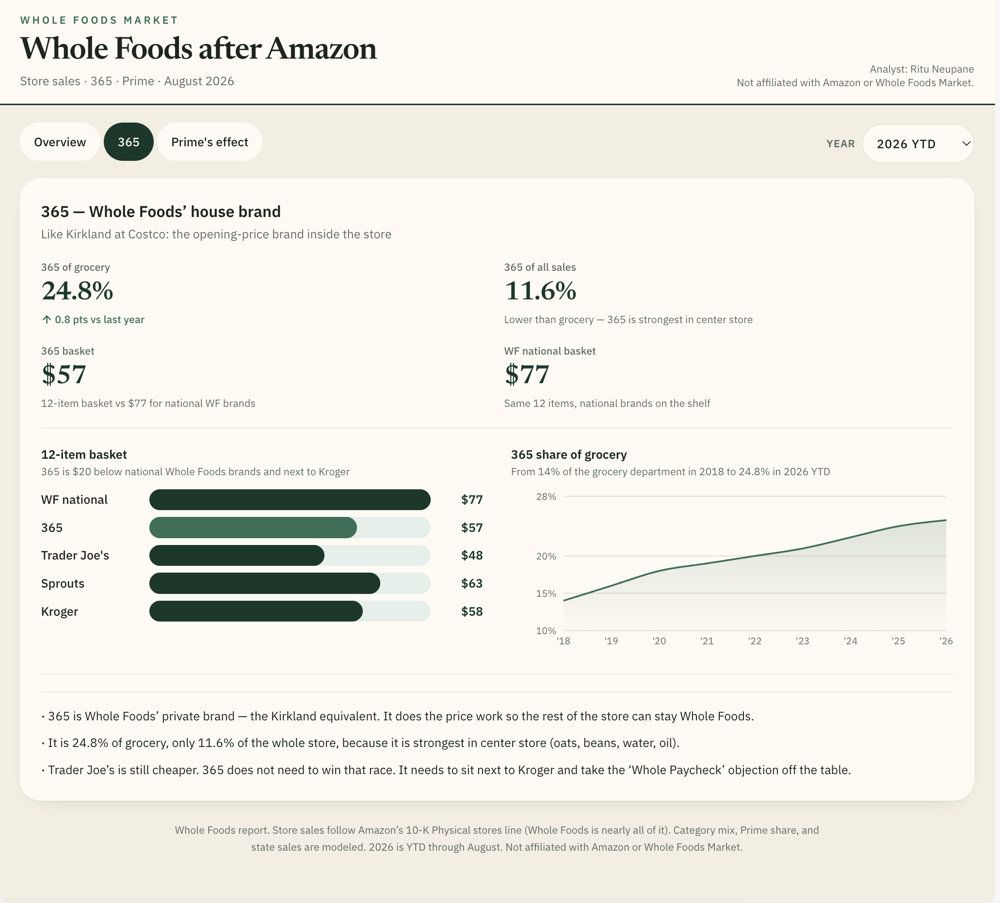
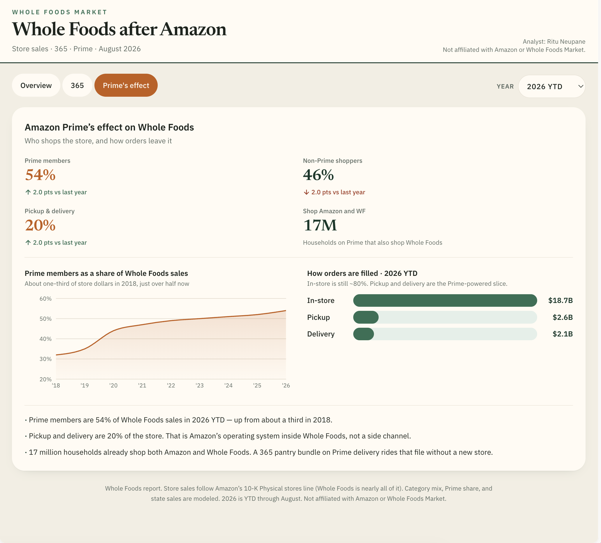

# Whole Foods after Amazon

I pulled Amazon’s public 10-K Physical stores line (2018–2025) and asked three questions a merchant would actually ask:

1. How big is Whole Foods now?
2. What is 365 doing as the house brand?
3. What did Amazon Prime change about who shops the store, and how orders leave it?

**Ritu Neupane**

This is my own compilation. Not affiliated with Amazon or Whole Foods Market. Not a stock pick.

Store sales are **Whole Foods store dollars**. Amazon reports them as “Physical stores.” Whole Foods is nearly all of that line.

## What I found

- Store sales went from **$17.2B (2018)** to **$22.6B (2025)** and **$23.4B annualized in 2026 YTD** — about **36% above 2018**. Whole Foods is now Amazon’s only physical grocery banner.
- **365** is 24.8% of grocery and only 11.6% of the whole store. A 12-item 365 basket is **$57 vs $77** for national Whole Foods brands, next to Kroger ($58). Trader Joe’s is still cheaper ($48). 365 does not need to win that race.
- **Prime members** are about **54%** of Whole Foods sales in 2026 YTD, up from about a third in 2018. Pickup and delivery are **20%** of the store. 17 million households already shop both Amazon and Whole Foods.

Category mix, Prime share, state sales, and the basket are modeled from public store counts and grocery research. The 10-K dollars are not. Detail: [`data/SOURCES.md`](data/SOURCES.md).

## Dashboard

**Overview** — store sales, category, state



**365** — house brand



**Prime’s effect** — who shops, how orders leave



## Files

```
data/wfm_annual.csv        10-K store sales, stores, 365, Prime
data/category_mix.csv      five departments × year
data/prime_channel.csv     Prime share, in-store / pickup / delivery
data/state_sales.csv       top states
data/price_basket.csv      12-item basket vs peers
data/SOURCES.md            filing vs modeled
analysis/notes.md          takeaways
screenshots/               overview, 365, Prime
```
